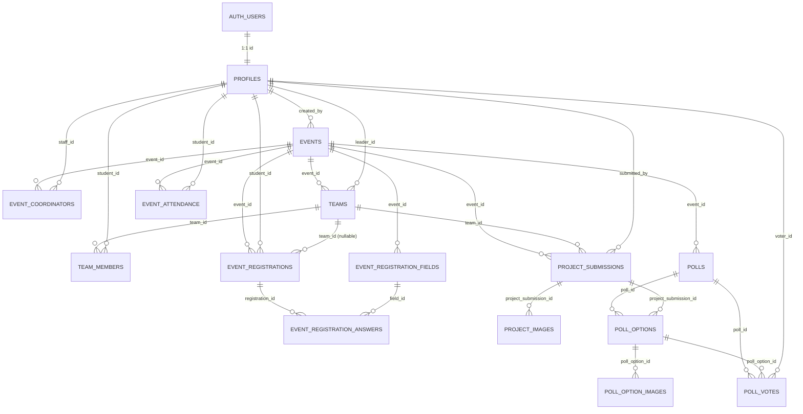
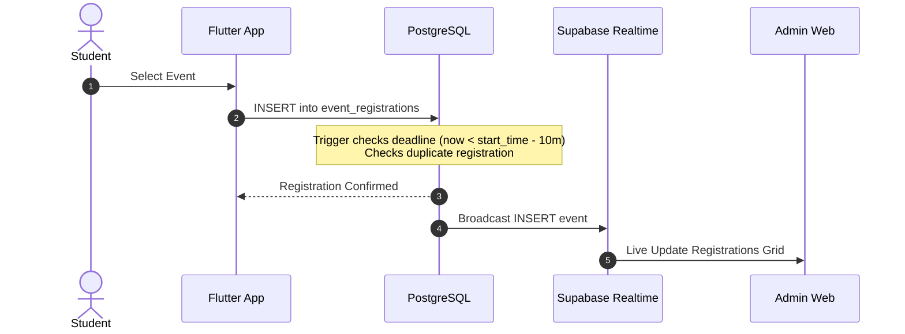
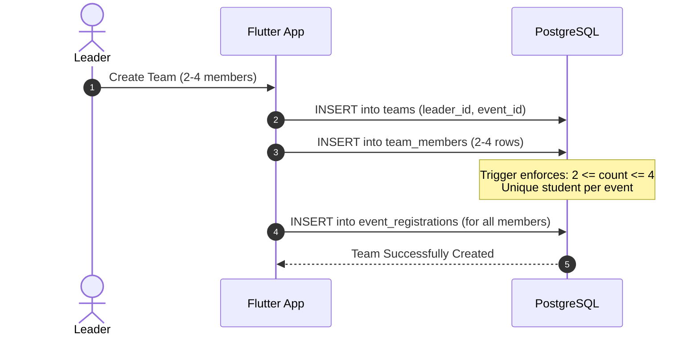
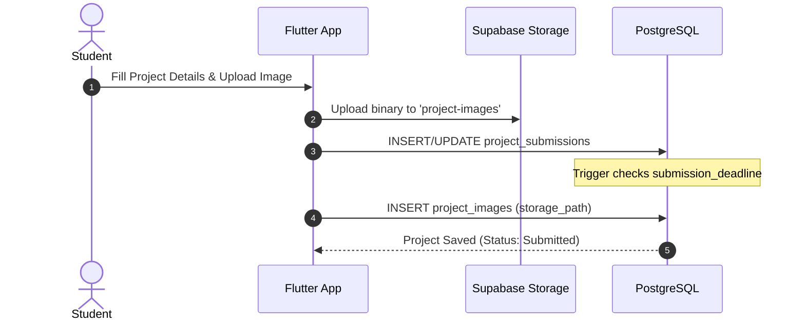
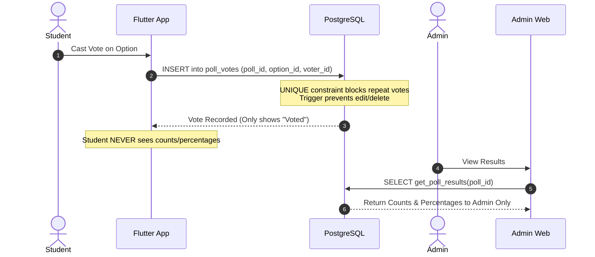

# ELITE College Event Management System — Database Architecture & Specification

## 1. Executive Summary
The ELITE College Event Management System utilizes a clean, production-grade PostgreSQL relational database deployed on Supabase. It acts as the single source of truth for both:
1. **Flutter Android Application (`elite_app`)**: Student & staff mobile client.
2. **Admin Web Application (`admin_portal`)**: Real-time management portal.

---

## 2. Complete Table List (15 Production Tables)

| # | Table Name | Description |
|---|---|---|
| 1 | `public.profiles` | User directory linked to `auth.users(id)` with roll number, roles (`student`, `staff`, `admin`), and academic details. |
| 2 | `public.events` | Dynamically created college events with schedules, deadlines, rules, and configuration flags. |
| 3 | `public.event_coordinators` | Relational coordinator mapping linking events to staff members. |
| 4 | `public.teams` | Team entities created for team events with unique names per event and designated leaders. |
| 5 | `public.team_members` | Team membership records enforcing the fixed 2–4 member rule. |
| 6 | `public.event_registrations` | Student participation registrations for individual or team events. |
| 7 | `public.event_registration_fields` | Dynamic form field definitions configured by administrators for events. |
| 8 | `public.event_registration_answers` | Student dynamic form responses corresponding to custom fields. |
| 9 | `public.project_submissions` | Project showcase submissions (repositories, demos, pitch decks) with server-enforced deadline lock. |
| 10 | `public.project_images` | Gallery/showcase images for project submissions stored in Supabase Storage. |
| 11 | `public.polls` | College opinion polls and art gallery/competition showcase voting containers. |
| 12 | `public.poll_options` | Selectable options for polls, linked to project submissions for showcases. |
| 13 | `public.poll_option_images` | Visual assets/images attached to poll options. |
| 14 | `public.poll_votes` | Cast votes strictly enforcing **one vote per user per poll** (`UNIQUE (poll_id, voter_id)`). |
| 15 | `public.event_attendance` | Turnstile & event QR attendance records scanned by coordinators. |

---

## 3. Primary & Foreign Keys and Relationships

---

## 4. Important Constraints & Data Integrity

1. **Fixed Team Size (2 to 4 Members)**:
   - Enforced by server trigger `check_team_member_rules()` on `team_members`.
   - Teams cannot exceed 4 members. Cross-team membership in the same event is strictly prevented.
2. **Registration Deadline (10 Minutes Prior to Start Time)**:
   - Server trigger `check_registration_rules()` on `event_registrations`.
   - Normal student registration automatically closes at `event_date + start_time - INTERVAL '10 minutes'`.
   - Admins can bypass the deadline for manual registrations, but team size and duplicate restrictions remain strictly enforced.
3. **Strict One Vote Per User**:
   - `CONSTRAINT uq_poll_single_voter UNIQUE (poll_id, voter_id)` on `poll_votes`.
   - Trigger `enforce_vote_immutability()` prevents votes from being updated or deleted once cast.
4. **Project Submission Deadline**:
   - Trigger `check_project_submission_deadline()` prevents any student edits, additions, or image uploads once `events.submission_deadline` has passed.
5. **No Password Exposure**:
   - Authentication is strictly handled by Supabase Auth (`auth.users`).
   - Passwords are never stored or exposed in database tables.

---

## 5. Row Level Security (RLS) Policies

All 15 tables have RLS enabled:
- **`profiles`**: Public readable; users can update their own profile; admins have full access.
- **`events`**: Public can view published/ongoing/completed events; admins have full CRUD.
- **`event_registrations`**: Students can view their own registrations; admins can view all.
- **`teams` & `team_members`**: Students can view their own teams; admins have full access.
- **`project_submissions`**: Public can only view published projects (`is_published = true`). Team members can view and submit/edit their project before the deadline. Admins have full access.
- **`polls` & `poll_options`**: Active polls viewable by eligible roles (`student`, `staff`).
- **`poll_votes`**: **Strict Confidentiality**: Students can ONLY view their own vote (`voter_id = auth.uid()`). Students **never** receive vote counts, totals, or peers' voting decisions. Vote counts are accessed exclusively by admins via the secure RPC function `get_poll_results(p_poll_id UUID)`.
- **`event_attendance`**: Students view their own attendance logs; staff and admins record/view all logs.

---

## 6. Supabase Storage Buckets

The following storage buckets are provisioned and secured with RLS:
1. `event-images`: Promotional banners and posters (Public read, Admin upload).
2. `event-rules`: Official rules and guideline PDFs (Public read, Admin upload).
3. `project-files`: Project documentation and presentation slides (Authenticated upload).
4. `project-images`: Project screenshots and demo galleries (Public read, Authenticated upload).
5. `poll-images`: Visual poll option assets (Public read, Admin upload).

---

## 7. Supabase Realtime Tables

The `supabase_realtime` publication is configured with `REPLICA IDENTITY FULL` on:
- `public.event_registrations`
- `public.teams`
- `public.team_members`
- `public.project_submissions`
- `public.polls`
- `public.poll_votes`

The Admin Web application subscribes to these realtime channels to display live registrations, project updates, and voting activity instantaneously without page refresh.

---

## 8. Database Functions & Triggers

1. `check_registration_rules()`:
   - Enforces registration status (`registration_enabled = true` and `registration_closed_manually = false`).
   - Enforces automatic 10-minute cutoff prior to `event_date + start_time`.
   - Validates that `event_type = 'individual'` has `team_id IS NULL` and `event_type = 'team'` requires a team.
2. `check_team_member_rules()`:
   - Validates team size is between 2 and 4.
   - Prevents a student from belonging to multiple teams in the same event.
   - Enforces exactly one team leader.
3. `check_project_submission_deadline()`:
   - Enforces `events.submission_deadline` on `project_submissions` and `project_images`.
4. `enforce_vote_immutability()`:
   - Blocks any `UPDATE` or `DELETE` operations on `poll_votes`.
5. `get_poll_results(p_poll_id UUID)`:
   - Secure `SECURITY DEFINER` function returning option vote counts and percentages exclusively to staff and admins.

---

## 9. Core System Workflows

### 9.1 Registration Flow

### 9.2 Team Creation Flow

### 9.3 Project Submission Flow

### 9.4 Voting Flow

### 9.5 Admin Manual Registration Flow
- Admin opens the registration modal in the Admin Portal (`admin_portal`).
- Admin selects a student (or enters roll number) and event.
- If individual: Inserts directly into `event_registrations`. Trigger recognizes `admin` role and allows bypass of the 10-minute deadline while preserving duplicate prevention.
- If team: Admin selects or creates a team, adds 2 to 4 members, and registers them. Database verifies valid students and maximum team size of 4.

---

## 10. Verification & Test Confirmation
- Automated migration runner: `admin_portal/apply_migrations.mjs` executed cleanly.
- Integrity verification script: `admin_portal/test_fresh_schema.mjs` validated:
  - 15 production tables verified.
  - 5 storage buckets active.
  - 10-minute registration deadline successfully blocked late registration.
  - Team size limits (maximum 4) and duplicate cross-team registration prevented.
  - Single-vote unique constraint and vote immutability enforced.
  - Database cleaned back to zero demo records with only the administrator profile.
